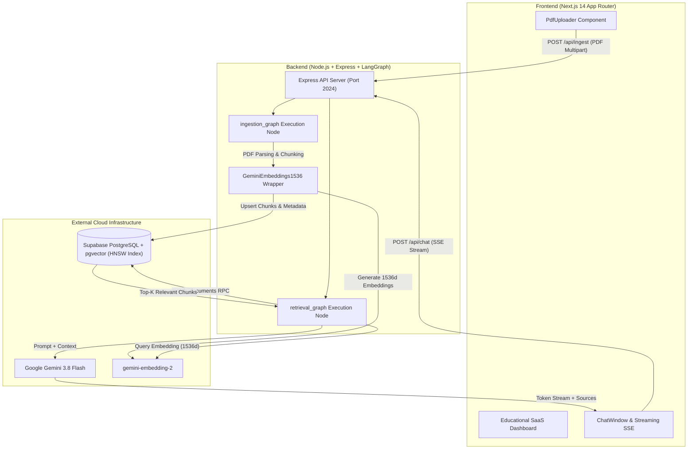

# AI PDF Chatbot

An AI-powered PDF question-answering application built with **LangGraph**, **LangChain**, **Google Gemini**, **Supabase pgvector**, and **Next.js**. Upload PDF documents, index their content into 1536-dimensional vector embeddings, and ask natural-language questions using a Retrieval-Augmented Generation (RAG) pipeline with streaming responses and inline page citations.

---

## Overview

The **AI PDF Chatbot** is a full-stack, enterprise-ready application designed to turn static PDF documents into interactive, searchable knowledge bases. Powered by **Google Gemini 3.8 Flash** for text generation and **gemini-embedding-2** for vector embeddings, the system parses uploaded PDFs, breaks them down into recursive text chunks, indexes them in a **Supabase PostgreSQL** database using `pgvector` HNSW cosine indexing, and streams answers with exact document page citations.

---

## Features

- 📄 **Multi-PDF Document Ingestion**: Drag and drop single or multiple PDF documents (up to 50 MB each).
- 🧩 **Recursive Text Chunking**: Splits PDF text into overlapping chunks using `RecursiveCharacterTextSplitter` (1000 characters, 200 overlap).
- ⚡ **1536d Gemini Embeddings**: Utilizes `gemini-embedding-2` with a custom 1536-dimension wrapper for direct compatibility with Supabase `pgvector`.
- 🔍 **Vector Cosine Similarity Search**: HNSW-indexed cosine distance similarity matching via custom Supabase `match_documents` RPC.
- 💬 **Real-Time SSE Streaming Chat**: Interactive chatbot streaming answer tokens with Server-Sent Events (SSE).
- 📌 **Exact Source Citations**: Inline attribution displaying filename, page number, and relevant text snippet for ground-truth verification.
- 🎨 **Educational / SaaS Dashboard UI**: Designed with a sleek light dashboard aesthetic, responsive sidebar, document management table, and stats overview.
- 🛠️ **LangGraph Architecture**: Modular `ingestion_graph` and `retrieval_graph` execution nodes.

---

## Architecture



---

## Tech Stack

| Domain | Technology | Purpose |
| :--- | :--- | :--- |
| **Frontend Framework** | [Next.js 14](https://nextjs.org/) (App Router) | Responsive dashboard & SSR/Client rendering |
| **Styling & UI** | [Tailwind CSS](https://tailwindcss.com/) & [Lucide Icons](https://lucide.dev/) | Light SaaS dashboard visual system |
| **Backend Runtime** | [Node.js](https://nodejs.org/) & Express | REST API & LangGraph execution server |
| **AI Orchestration** | [LangGraph JS](https://langchain-ai.github.io/langgraphjs/) & [LangChain](https://js.langchain.com/) | Graph-based state machine workflow |
| **AI Models** | [Google Gemini 3.8 Flash](https://ai.google.dev/) | Fast, structured text generation |
| **Embedding Model** | [gemini-embedding-2](https://ai.google.dev/) | 1536-dimensional vector generation |
| **Vector Database** | [Supabase PostgreSQL](https://supabase.com/) with `pgvector` | HNSW-indexed vector similarity storage |
| **Language** | TypeScript | End-to-end type safety |

---

## How It Works

```
PDF Upload ──> PDF Parsing ──> Text Chunking ──> Gemini Embeddings (1536d)
                                                         │
                                                         ▼
Streaming Answer <── Gemini 3.8 Flash <── Vector Search (pgvector HNSW)
      │
      └── Source Page Citations
```

1. **Upload & Ingestion**: User drops a PDF file in the web UI. The backend receives the binary stream, parses text via `pdf-parse`, and chunks text recursively.
2. **Vectorization**: Text chunks are passed to `GeminiEmbeddings1536` (`gemini-embedding-2`), generating 1536-dimensional dense vector embeddings.
3. **Database Storage**: Chunks and metadata (`filename`, `page`, `chunk_index`) are stored in the Supabase `documents` table.
4. **Retrieval**: When a question is submitted, the backend converts the query to a 1536d vector and executes the Supabase `match_documents` RPC function using HNSW cosine similarity.
5. **Generation**: Top matching context chunks are formatted into a prompt and submitted to `gemini-3.8-flash`.
6. **Streaming & Citations**: Response tokens are streamed back via Server-Sent Events (SSE) alongside exact page and file citations.

---

## Project Structure

```
AI-Pdf-Chatbot-Langchain/
├── frontend/                     # Next.js App Router Frontend
│   ├── app/                      # Main Layout & Dashboard pages
│   ├── components/               # Modular UI components
│   │   ├── dashboard/            # Sidebar, Header, MobileNav, StatsCard, SettingsView
│   │   ├── documents/            # PdfUploader, DocumentCard, DocumentList
│   │   └── chat/                 # ChatWindow, ChatMessage, ChatInput, SourceCard
│   ├── lib/                      # API Client & TypeScript Types
│   ├── .env.example              # Frontend Environment Template
│   └── package.json
│
├── backend/                      # Node.js LangGraph Server
│   ├── src/
│   │   ├── ingestion/            # PDF Ingestion LangGraph Graph & Loader
│   │   ├── retrieval/            # Vector Retriever, Context Generator & Chat Graph
│   │   ├── shared/               # Gemini Models & Supabase Client Setup
│   │   └── server.ts             # Express REST & SSE Server
│   ├── .env.example              # Backend Environment Template
│   ├── langgraph.json            # LangGraph Configuration
│   └── package.json
│
├── supabase/
│   ├── schema.sql                # Complete pgvector Schema & RPC Functions
│   └── README.md                 # Database setup instructions
│
├── .gitignore                    # Global git ignore rules
└── README.md                     # Project Documentation
```

---

## Prerequisites

- **Node.js**: v18.0.0 or higher (v20+ recommended)
- **npm**: v9.0.0 or higher
- **Google Gemini API Key**: Obtain from [Google AI Studio](https://aistudio.google.com/)
- **Supabase Account & Project**: Create at [Supabase Console](https://database.new)

---

## Environment Variables

### Frontend Environment (`frontend/.env.local`)

Create `frontend/.env.local` using `frontend/.env.example` as reference:

```env
# Backend Server API URL
NEXT_PUBLIC_API_URL=http://localhost:2024
NEXT_PUBLIC_LANGGRAPH_API_URL=http://localhost:2024

# LangGraph Assistant Identifiers
LANGGRAPH_INGESTION_ASSISTANT_ID=ingestion_graph
LANGGRAPH_RETRIEVAL_ASSISTANT_ID=retrieval_graph
```

### Backend Environment (`backend/.env`)

Create `backend/.env` using `backend/.env.example` as reference:

```env
# Google Gemini Credentials
GEMINI_API_KEY=your_gemini_api_key_here

# Supabase PostgreSQL Credentials
SUPABASE_URL=https://your-project.supabase.co
SUPABASE_SERVICE_ROLE_KEY=your_supabase_service_role_key_here

# Backend Server Port & CORS
PORT=2024
CORS_ALLOWED_ORIGINS=http://localhost:3000
```

> ⚠️ **Security Warning**: Never expose `GEMINI_API_KEY` or `SUPABASE_SERVICE_ROLE_KEY` to client-side code. They belong strictly in `backend/.env`.

---

## Supabase Database Setup

1. Open your Supabase Project Dashboard.
2. Navigate to **SQL Editor**.
3. Copy the full content of [`supabase/schema.sql`](./supabase/schema.sql) and execute it.
4. This script will:
   - Enable the `vector` extension (`pgvector`).
   - Create the `documents` table with `VECTOR(1536)` column.
   - Create HNSW cosine similarity index (`documents_embedding_hnsw_idx`).
   - Create GIN index on metadata (`documents_metadata_gin_idx`).
   - Define `match_documents`, `get_indexed_documents`, and `delete_document_by_filename` RPC functions.

---

## Local Development

### 1. Install Dependencies

```bash
# Install frontend dependencies
cd frontend
npm install

# Install backend dependencies
cd ../backend
npm install
```

### 2. Start the Backend Server

```bash
cd backend
npm run dev
```
The backend server will start on `http://localhost:2024`. You can verify health at `http://localhost:2024/health`.

### 3. Start the Frontend Application

```bash
cd frontend
npm run dev
```
Open your browser and navigate to `http://localhost:3000`.

---

## API & LangGraph Architecture

### Endpoints

- `GET /health` - Backend connection status and active assistant graph identifiers.
- `POST /api/ingest` - Accepts multipart form data with PDF files and invokes `ingestion_graph`.
- `POST /api/chat` - Accepts question, chat history, and `stream: true` to stream SSE tokens and citations.
- `GET /api/documents` - Fetches aggregated summary of indexed documents from Supabase.
- `DELETE /api/documents/:filename` - Deletes all vector embeddings associated with a filename.

---

## Deployment

### Frontend Deployment (Vercel)

1. Push your repository to GitHub.
2. Import the repository into [Vercel](https://vercel.com).
3. Set the root directory to `frontend`.
4. Configure environment variable:
   - `NEXT_PUBLIC_API_URL`: Your deployed backend URL (e.g., `https://your-backend.onrender.com`).

### Backend Deployment (Render / Railway)

1. Deploy the `backend/` directory as a Node.js Web Service on [Render](https://render.com) or [Railway](https://railway.app).
2. Set build command: `npm run build`
3. Set start command: `npm run start`
4. Add environment variables:
   - `GEMINI_API_KEY`
   - `SUPABASE_URL`
   - `SUPABASE_SERVICE_ROLE_KEY`
   - `CORS_ALLOWED_ORIGINS`: Your deployed frontend URL (e.g., `https://your-app.vercel.app`).

---

## Troubleshooting

- **`match_documents RPC error`**: Ensure `supabase/schema.sql` was executed completely in Supabase SQL Editor.
- **`GEMINI_API_KEY is not defined`**: Verify `GEMINI_API_KEY` is set inside `backend/.env`.
- **CORS Error**: Ensure `CORS_ALLOWED_ORIGINS` in `backend/.env` includes `http://localhost:3000` (or your frontend domain).

---

## Security Notes

- API keys and database service role credentials are kept exclusively on the Node.js backend.
- CORS policies prevent unauthorized origin access in production.
- Vector matching is parameterized via PostgreSQL RPC to prevent SQL injection.

---

## Future Improvements

- [ ] **Multi-tenant Auth**: Integrate NextAuth / Supabase Auth for user-isolated document workspaces.
- [ ] **Hybrid Search**: Combine BM25 keyword search with vector similarity for hybrid retrieval score boosting.
- [ ] **OCR Support**: Add Tesseract / Vision integration for scanned image-only PDFs.

---

## License

This project is licensed under the [MIT License](LICENSE).
